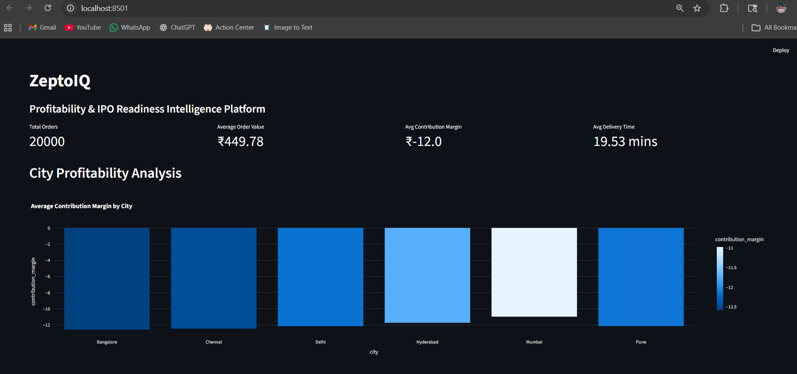
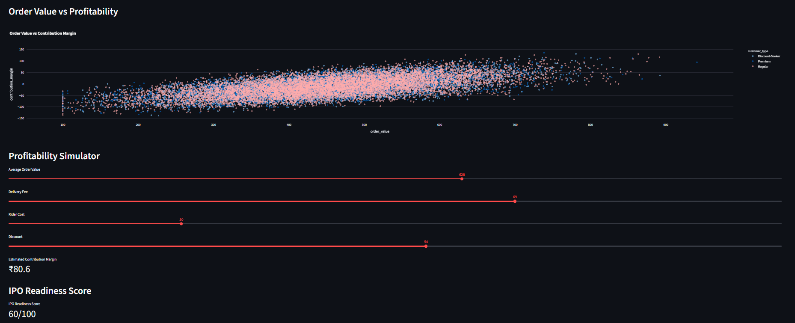

# ZeptoIQ
## Quick-Commerce Profitability & IPO Readiness Intelligence Platform

> A strategic analytics, profitability intelligence, and operational simulation platform built around Zepto’s dark-store business model.

---

# 🏆 National-Level Case Competition Recognition

This project originated from a national-level consulting and strategy case competition hosted at **MNNIT Allahabad**, where our team secured:
## 🥈 2nd Position

The original case focused on evaluating:

> **“Can Zepto’s dark-store model scale profitably ahead of its IPO ambitions?”**

This repository transforms the original competition pitch into a complete end-to-end analytics, strategy, and operational intelligence platform.

---

# 📌 Business Problem

India’s quick-commerce ecosystem is scaling aggressively through:
- 10-minute delivery models
- dark-store infrastructure
- hyperlocal fulfillment systems

However, sustainable profitability remains uncertain due to:
- rider subsidies
- discount wars
- operational inefficiencies
- delivery cost volatility
- aggressive competition from Blinkit, Swiggy Instamart, Tata & Reliance

ZeptoIQ was built to analyze whether quick-commerce can realistically achieve scalable profitability and IPO readiness.

---

# 🧠 Core Strategic Insight

> **Quick-commerce profitability is fundamentally a density and operational intelligence problem — not merely a speed problem.**

The platform explores how:
- basket size
- operational density
- dynamic pricing
- customer segmentation
- delivery efficiency

collectively determine long-term profitability and valuation sustainability.

---

# 🚀 Platform Capabilities

## 📊 Operational Analytics
- Unit economics analysis
- Dark-store profitability modeling
- Rider-cost analytics
- Delivery efficiency analysis

## 💰 Profitability Intelligence
- Contribution margin analysis
- AOV sensitivity modeling
- Pricing optimization engine
- Profitability heatmaps

## 🧠 Customer Intelligence
- Customer segmentation
- Profitability cohort analysis
- Loyalty behavior modeling
- High-value customer identification

## 📈 Forecasting & Growth Intelligence
- Demand forecasting
- Profit trajectory modeling
- Operational growth analysis
- Time-series forecasting

## 🏦 IPO Readiness & Investor Analytics
- GMV multiple valuation
- IPO readiness scoring
- Margin stability analysis
- Valuation sensitivity modeling

## ⚔ Strategic Stress Testing
- Demand spike simulation
- Discount-war scenarios
- Labor regulation impact analysis
- Operational risk simulations

---

# 🖥 Executive Dashboard Preview

## Executive Profitability Dashboard


---

## 📌 Key Insights Extracted

- Higher basket values significantly improve contribution margins
- Delivery-cost volatility heavily impacts profitability stability
- Café and beauty categories exhibit stronger margin potential
- Operational density matters more than delivery speed alone
- Aggressive discounting rapidly destroys contribution margins
- IPO readiness depends more on margin stability than hypergrowth

---

# ⚡ Pricing Intelligence Engine

The project includes a dynamic pricing intelligence framework inspired by real-world quick-commerce operational tradeoffs.

### Features
- Z-Score operational pricing model
- Dynamic delivery fee recommendation
- Profitability-aware pricing logic
- Demand-intensity simulation
- Margin optimization analytics


---

# 🧩 Interactive Executive Platform

The project also includes an interactive Streamlit-based executive intelligence platform.

### Features
- Real-time profitability simulator
- Dynamic KPI dashboard
- IPO readiness evaluation
- Operational profitability exploration
- Interactive business intelligence visualizations

🔗 **Live App:** [Click here to view](https://zeptoiq.streamlit.app/)
 

---

# 🏗 System Architecture

```text
Synthetic Operational Dataset
            ↓
Data Processing & KPI Engine
            ↓
SQL Business Intelligence Layer
            ↓
Analytics & Forecasting Modules
            ↓
Pricing Intelligence Engine
            ↓
Scenario Simulation Engine
            ↓
Power BI + Streamlit Executive Dashboards
```

---

# 🧪 Core Analytics Modules

| Module | Purpose |
|---|---|
| Unit Economics Engine | Contribution margin & profitability analysis |
| Pricing Engine | Dynamic delivery fee optimization |
| Forecasting Engine | Demand & growth prediction |
| IPO Valuation System | Investor-readiness analytics |
| Segmentation Engine | Customer profitability analysis |
| Simulation Engine | Strategic stress testing |

---

# 🛠 Tech Stack

### Analytics & Data
- Python
- Pandas
- NumPy
- SQL

### Visualization
- Power BI
- Plotly
- Matplotlib

### Interactive Platform
- Streamlit

### Forecasting & Modeling
- Prophet
- Scenario Simulation Models

---

# 📂 Repository Structure

```text
data/           → datasets & processed data
notebooks/      → analytics notebooks
dashboards/     → Power BI dashboards
sql/            → SQL business intelligence queries
src/            → reusable analytics modules
reports/        → strategic findings & reports
presentation/   → original competition deck
visuals/        → dashboard screenshots & charts
app/            → Streamlit executive platform
```

---

# 📈 Business Impact & Strategic Value

ZeptoIQ demonstrates how analytics and operational intelligence can help quick-commerce companies:

- improve contribution margins
- optimize delivery pricing
- reduce operational inefficiencies
- identify high-value customer cohorts
- evaluate IPO readiness
- stress-test strategic decisions

---

# 🔮 Future Enhancements

Potential future upgrades include:
- geographic optimization models
- real-time API integrations
- advanced ML demand forecasting
- cloud deployment
- live operational dashboards

---

# 👨‍💻 Author

**Mujahid Kalanthar**  
ECE • MNNIT Allahabad  
