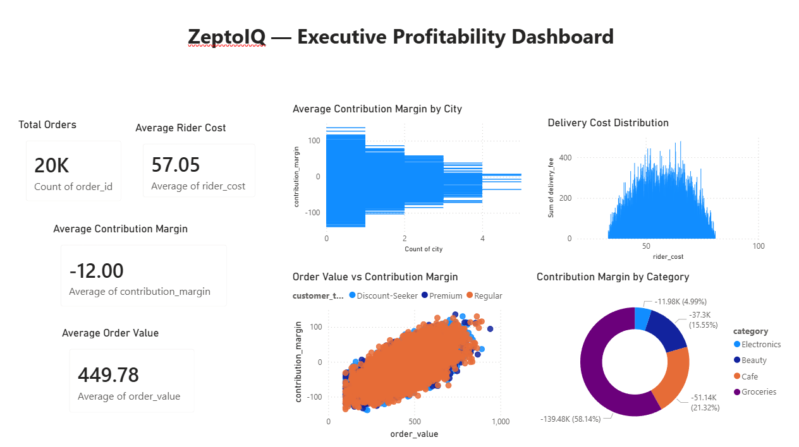
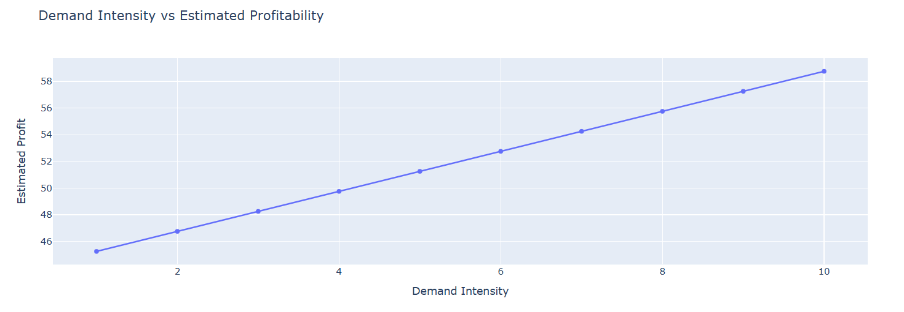

# ZeptoIQ
### Profitability & IPO Readiness Intelligence Platform for Quick Commerce

## Overview
ZeptoIQ is a strategic analytics and profitability intelligence platform designed to evaluate the scalability, operational efficiency, and IPO readiness of quick-commerce businesses.

Originally developed from a national-level consulting case competition, this project expands the original strategic pitch into a complete analytics ecosystem including:

- Unit economics analysis
- Dark-store profitability modeling
- Pricing intelligence engine
- Operational analytics
- IPO readiness evaluation
- Executive business dashboards

## Dashboard Preview

### Executive Profitability Dashboard



---

### Key Insights

- Higher AOV strongly improves contribution margins
- Delivery cost volatility significantly impacts profitability
- Café and beauty categories show stronger margin potential
- City-wise profitability varies due to operational density
---
---

## Pricing Intelligence Engine

The project includes a dynamic pricing intelligence framework inspired by real-world quick-commerce operational tradeoffs.

### Features

- Z-Score operational pricing model
- Dynamic delivery fee recommendation
- Profitability-aware pricing logic
- Demand intensity simulation
- Margin optimization analytics

### Pricing Engine Preview



---

## Customer Intelligence & Segmentation

The platform includes customer-level profitability segmentation to identify high-value operational cohorts.

### Features

- Customer profitability analysis
- Basket value segmentation
- Loyalty behavior modeling
- High-value user identification
- Segment-level contribution analysis

### Key Strategic Insight

Not all customers contribute equally to profitability. Premium loyal users generate significantly stronger margins and operational stability compared to low-engagement or discount-sensitive users.

## Core Objectives

- Analyze quick-commerce profitability drivers
- Evaluate dark-store operational efficiency
- Build a dynamic pricing intelligence framework
- Simulate profitability under different operational scenarios
- Assess IPO readiness using financial and strategic metrics

---

## Tech Stack

- Python
- Pandas & NumPy
- SQL
- Power BI
- Streamlit
- Plotly

---

## Repository Structure

```text
data/           → datasets
notebooks/      → analytics notebooks
dashboards/     → Power BI dashboards
sql/            → SQL business queries
src/            → Python modules
reports/        → strategic reports
presentation/   → original case deck
```

---

## Status
🚧 Currently under development